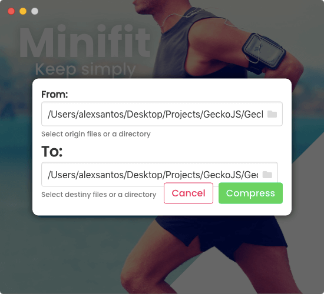

# Minifit | Keep Simply

This is Minifit app source files to compile with [ElectronJs]("https://electronjs.org/")

Minifit is a JavaScript compressor, beutify and compiler for ES6, this app works with [GeckoJs]("https://blobysoftware.github.io/GeckoJsPage/")  for a better js code, this app have a simply design with [Bulma]("https://bulma.io/") and compressions by [UglifyJs]("https://www.npmjs.com/package/uglify-js").

--------------------------------------------

## Drag and Drop
Just drag your files or folders to compress it , minifit know what files are compressed, and minify in 1 second, its compression on fly.

## Select origin an destination files
Options box: you can select the output path of your files, with selection box or write the path yourself (Erros: If you try to change to a wrong path or not javascript files, minifit throw the error in a error box).

## Output name
Minifit converts by default all files extension (.js) to (.min.js) but you can change the output extension and the file name by other or change type of file like: from( file.js ) to ( file.ts ).

------------------------

# All rights reserved

Minifit is developed by BlobySoftware®, Minifit use GeckoJs  to a better JavaScript code and compressions.
